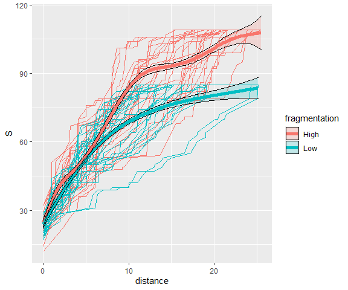
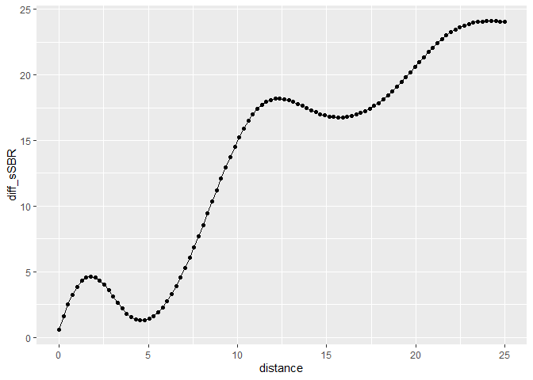

<!-- README.md is generated from README.Rmd. Please edit that file -->

``` r
library(spatialbiodiv)
library(tidyverse)
#> ── Attaching packages ─────────────────────────────────────── tidyverse 1.3.2 ──
#> ✔ ggplot2 3.3.6      ✔ purrr   0.3.4 
#> ✔ tibble  3.1.8      ✔ dplyr   1.0.10
#> ✔ tidyr   1.2.1      ✔ stringr 1.4.1 
#> ✔ readr   2.1.2      ✔ forcats 0.5.2 
#> ── Conflicts ────────────────────────────────────────── tidyverse_conflicts() ──
#> ✖ dplyr::filter() masks stats::filter()
#> ✖ dplyr::lag()    masks stats::lag()
library(vegan)
#> Lade nötiges Paket: permute
#> Lade nötiges Paket: lattice
#> This is vegan 2.6-2
library(scam)
#> Lade nötiges Paket: mgcv
#> Lade nötiges Paket: nlme
#> 
#> Attache Paket: 'nlme'
#> 
#> Das folgende Objekt ist maskiert 'package:dplyr':
#> 
#>     collapse
#> 
#> This is mgcv 1.8-40. For overview type 'help("mgcv-package")'.
#> This is scam 1.2-13.
```

# spatialbiodiv

<!-- badges: start -->
<!-- badges: end -->

The goal of spatialbiodiv is to calculate spatial and sample-based
species rarefaction curves (sSBR) and distance-decay of similarity curve
from spatially-explicit biodiversity data (i.e.) species
presences-absences or abundances from standardized samples in
landscapes.

## Installation

You can install the development version of spatialbiodiv from
[GitHub](https://github.com/) with:

``` r
# install.packages("devtools")
devtools::install_github("FelixMay/spatialbiodiv", build_vignettes = TRUE)
#> Skipping install of 'spatialbiodiv' from a github remote, the SHA1 (709244e0) has not changed since last install.
#>   Use `force = TRUE` to force installation
```

# Example 1

For an example application see the package vignette “Test analysis of
simulated data”:

``` r
library(spatialbiodiv)
browseVignettes("spatialbiodiv")
#> starte den http Server für die Hilfe fertig
```

# Example 2: Get differences between distance-based curves

## Read and prepare the data

The data was generated by a dynamic and [spatial model for community
dynamics in fragmented
landscapes](https://github.com/Stavooo/Fragmentation_Model). Here, we
just extract two scenarios that only differ in their degree of
fragmentation per se.

``` r
simdat1 <- read.table("data_raw/GeDo_test5_rep_10_output_sample.txt", header = TRUE,
                      sep = ",")
simdat1 <- simdat1 %>% select(-X)
```

Filter high and low fragmentation scenarios

``` r
frag_low <- simdat1 %>%
  filter(step == 31 & fragmentation == 0.1)

frag_high <- simdat1 %>%
  filter(step == 31 & fragmentation == 0.5)
```

## Prepare data for spatial biodiversity curves

Get abundance data tables with rows in samples and species in columns

``` r
frag01_spec <- frag_low %>%
  select(sp_1:sp_200)

frag05_spec <- frag_high %>%
  select(sp_1:sp_200)
```

Get spatial coordinates of the samples

``` r
xy_frag01 <-  frag_low %>%
  select(loc_x, loc_y)

xy_frag05 <-  frag_high %>%
  select(loc_x, loc_y)
```

## Calculate spatial sample-based rarefaction curves (sSBR)

Actually the code for sSBR was adopted from the corresponding curves in
**mobr**. The only difference is that mobr has the cumulative sampling
effort on the x-axis, while here cumulative nearest neighbour distances
are on the x-axis.

``` r
sSBR_frag01 <- sSBR(comm = frag01_spec, xy_coords = xy_frag01)
sSBR_frag05 <- sSBR(comm = frag05_spec, xy_coords = xy_frag05)
```

## Create dataframe for plotting with ggplot

``` r
sSBR_frag01$sSBR_data$fragmentation <- "Low"
sSBR_frag01$sSBR_smooth$fragmentation <- "Low"

sSBR_frag05$sSBR_data$fragmentation <- "High"
sSBR_frag05$sSBR_smooth$fragmentation <- "High"

sSBR_data <- bind_rows(sSBR_frag01$sSBR_data, sSBR_frag05$sSBR_data)
sSBR_smooth <- bind_rows(sSBR_frag01$sSBR_smooth, sSBR_frag05$sSBR_smooth)
```

## Plot the sSBR curves

``` r
ggplot(sSBR_data, aes(distance, S, group = interaction(id, fragmentation),
                      color = fragmentation)) +
  geom_line() +
  geom_line(aes(distance, S, color = fragmentation, group = fragmentation),
            data = sSBR_smooth, size = 2) +
  geom_ribbon(aes(x = distance, y = S, ymin = S_low, ymax = S_high,
                  fill = fragmentation, group = fragmentation), color = "black",
              data = sSBR_smooth, alpha = 0.2)
```



## Calculate difference between the curves

Now, our key question if the two curves differ significantly. To answer
this, we first need to calculate the difference between the two curves.

### Calculate smallest maximim distance

We can only compare the curves up to the smallest maximum distance of
the two scenarios. So we get the minimal distance of the maxima of both
fragmentation scenarios

``` r
min_dist <- round(min(c(max(sSBR_frag01$sSBR_data$distance),
                        max(sSBR_frag05$sSBR_data$distance))))
```

### Distance values for interpolation

For interpolation we need the same distance-values for both curves

``` r
new_dist <- data.frame(distance = seq(0, min_dist, length = 100))
```

### Fit SCAM models for each scenario

``` r
scam_low_frag <- scam(S ~ s(distance, bs = "mpi"),
                      data = sSBR_frag01$sSBR_data, family = "poisson")
scam_high_frag <- scam(S ~ s(distance, bs = "mpi"),
                       data = sSBR_frag05$sSBR_data, family = "poisson")
```

### Predict species richness for new distance values

``` r
pred_low_frag <- predict(scam_low_frag, new_dist, type = "response")
pred_high_frag <- predict(scam_high_frag, new_dist, type = "response")

new_dist$diff_sSBR <- pred_high_frag - pred_low_frag
```

``` r
ggplot(new_dist, aes(distance, diff_sSBR)) +
  geom_point() + geom_line()
```



This is the difference for the red and blue curves in the previous
figure. This seems to indicate that for high fragmentation we find more
species for a given cumulative distance than with low fragmentation.

But of course, we cannot say anything about the **significance** of this
difference so far.

My opinion is that the confidence bands in the first figure are
potentially by far to narrow, because there is a lot of non-independence
among the points and curves in the ssBR.

I guess a permutation test that shuffles samples among the fragmentation
scenarios is the way to go.

With respect to coding the question is:

-   Integrate the permutation test into this mini package (likely with a
    lot of copy-paste from mobr code), or

-   Integrate these distance-based curves in mobr, which so far always
    has sampling effort (no. of samples or no. of individuals) on the
    x-axis and as basis for the comparison among curves.
